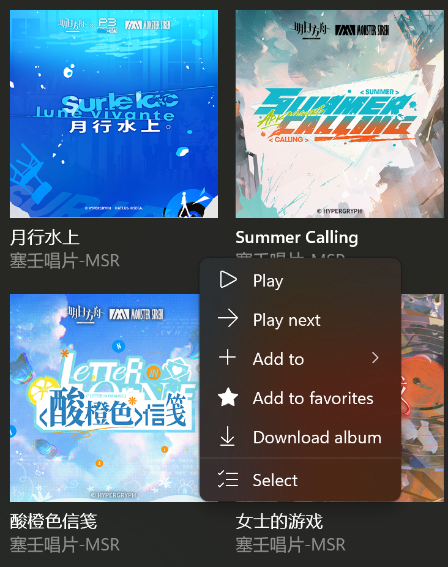
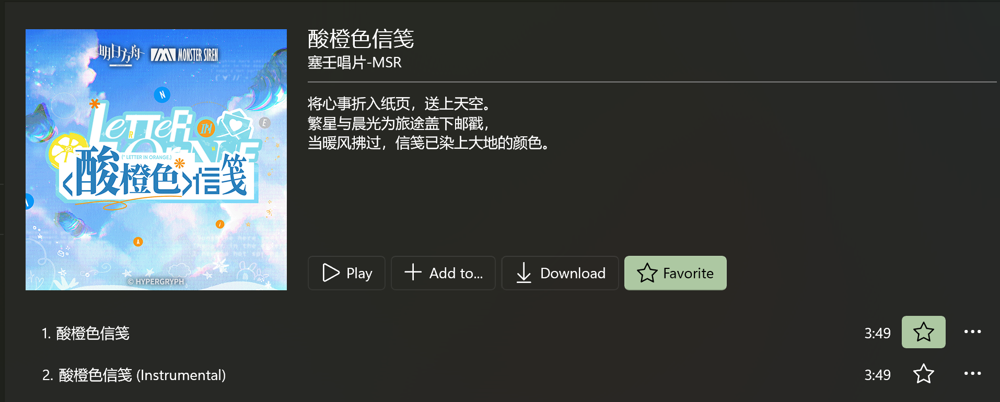
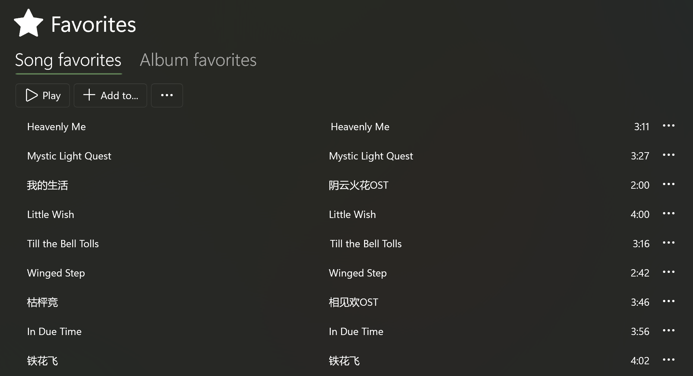
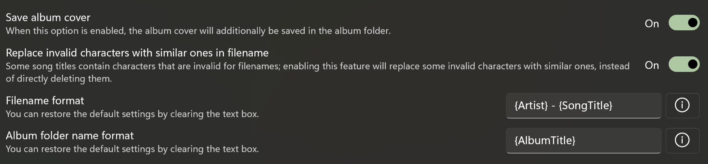

# Version 1.2.5.0

Welcome to the new version of Sora Records! This update mainly brings the following changes:

- Added Favorites feature – You can now add individual songs or entire albums to your favorites.
- Download enhancements – Support for custom filename and album folder name templates, plus the option to save cover images alongside downloads.
- Prioritize downloaded music during playback – Reduces network usage and improves offline playback experience.

Plus plenty of behind‑the‑scenes code refactoring!

---

## Favorites feature

You can now add your favorite individual songs or entire albums to your favorites.

Right‑click (or long‑press) on album covers, song entries, or playlist items to find the “Add to favorites” option. The album details page and song list also provide favorite buttons.

All favorited content is collected in the new “Favorites” page, where you can browse, play, download, or add items to a playlist. The favorites list supports backup and restore – you can find the relevant options in Settings → Storage settings to export your favorites as a JSON file, or restore them from a previously backed‑up file.

## Download enhancements

This update introduces several improvements to the download functionality:

- **Custom filename templates**: In Settings → Storage settings, you can now customize the filename format for downloaded songs. Available placeholders are listed on the settings page.
- **Custom album folder name templates**: Similarly, you can define the naming format for album folders. Placeholders are also shown on the settings page.
- **Save cover images**: When enabled, the app will save the album cover image to the corresponding album folder along with the downloaded songs.
- **Allow unnecessary transcoding**: For songs that are originally in MP3 format, the app will no longer transcode them to FLAC by default (to avoid pointless operations). If you still need this, you can enable “Allow unnecessary transcoding” in settings.
- **Bug fix**: Fixed an issue where downloads would not start when the album name ended with a dot.

## Playback improvements

- **Prioritize local files**: When a song has already been downloaded, the player will automatically use the local file for playback, reducing data usage and improving loading speed. You can toggle this feature in Settings → Playback settings.
- **Optimized audio duration retrieval**: The app now obtains song durations more quickly thanks to improved logic.

---

## Other miscellaneous updates + fixes

- Updated some text descriptions and adjusted several localization resources.
- Extensive code refactoring and bug fixes – if you're interested, check out the details [here](https://github.com/Baka632/MonsterSiren.Uwp/pull/33).

> Last but certainly not least, thank you for using Sora Records!