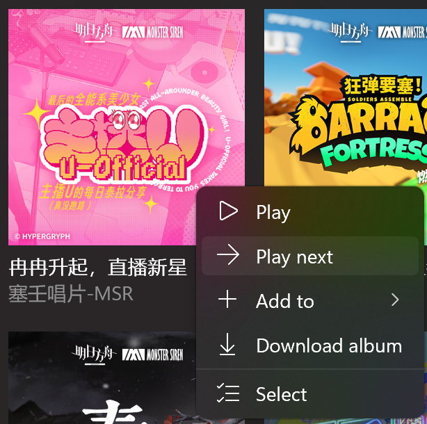

# Version 1.2.2.0

Welcome to use the new version of Sora Records, this update mainly made the following changes: 

- Glance Mode improvements - there are usage guides, more ways to exit, and a setting to keep the screen on now.
- Double tap to play - you can double tap the song in album and playlist to play it.
- Multi-select - Now you can use multi-select in Album Collection and Playlist pages.
- Updates on album details page - track number is added now.
- Download process improvements.
- Check update feature.

---

## Glance Mode improvements
### Usage guide

After entering Glance Mode, you may be overwhelmed.

In this release, we've added a guide to help you get the most out of Glance Mode.

### More ways to exit

In addition to clicking the back button on the title bar, you can press the Esc key and double-click anywhere to exit now.

### Remain display on

This version adds "Remain display on" setting to prevent screen savers or screen off when overview mode is enabled.

## Double tap to play

In album details page and playlist details page, you can double tap the song in the list to play it

## Multi-select

This version now allows you to use the multi-select on the Album Collection page and Playlist page.

However, if too many albums are selected on Album Collection page, there may be a warning when performing certain actions:

Be patient if you do want to do this, it will take some time......

## Updates on album details page

Track number is added for songs in the list now。

Notice: Track number is NOT added in playlist detail page.

## Download process improvements

The app now avoids duplicate downloads of songs, which are marked as "Skipped" in the download list.

In addition, "Canceling" status has been added for downloads. This status indicates that the download item is cleaning up the files that generated during the download process.

## Check update feature

Now the app will try to automatically check for updates, and if an update is available, the app will pop up a prompt.

---

## Other miscellaneous updates + fixes

- Remove quotation marks for some text
- Add virtualization to the download list
- Optimized the process of getting and saving album art
- Organize the XAML code that renders the settings item in the settings page into `SettingsExpander` and `SettingsCard` controls 
- Fixed the issue that an uncaught exception occurred when an invalid item was added to a playlist
- Fixed an issue where an unhandled exception occurred when refreshing without successfully retrieving the album in the Album Collection page
- Fixed the issue that the download status was incorrect when resuming the download after restarting the app
- Fixed an issue where the redirection information for the download folder and playlist folder was not displayed

> Last but certainly not least, thank you for using Sora Records!