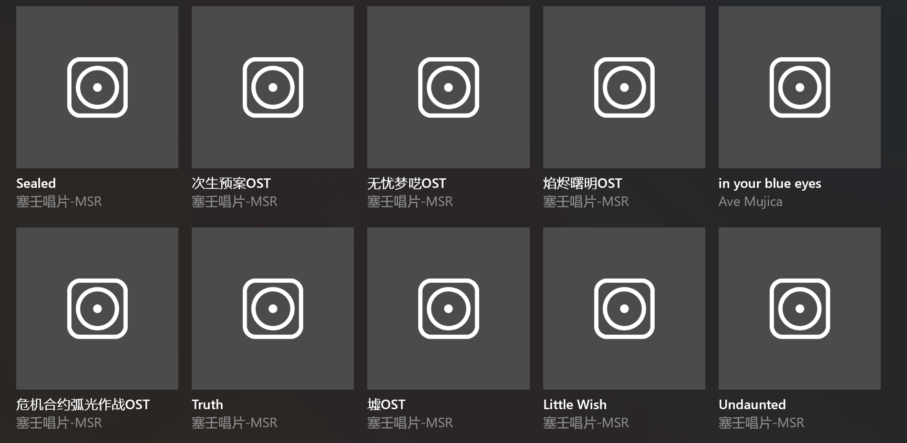

# Version 1.2.3.0

Welcome to use the new version of Sora Records, this update mainly made the following changes: 

- Audio casting - you can now cast music to other devices.
- Cortana support - If your device still supports Cortana, it can now access this app's features.

---

## Audio casting

You can now cast the currently playing music to other devices.

To use this feature, click "Start audio casting" in the overflow menu of the playback bar.

Afterwards, Windows "Connect" window will pop up. Please select the target device from the list.

Once selected, the chosen device will start playing. You can adjust its volume and play/pause the music from within Sora Records' window (requires support from the target device).

To stop audio casting, you can click the "Stop audio casting directly" button in the overflow menu.

You can also open the casting panel and click "Disconnect" in the "Connect" window.

When the application is in audio casting mode, an icon indicating audio casting will appear in the Glance Mode.

## Cortana support

If your device still supports Cortana, and the system version is earlier than Windows 10 2004 (Build 19041, in which Microsoft removed Cortana's voice command support), you can then attempt to use this application's features with Cortana.

In Cortana, the wake word for this application is "Sora", which means all voice commands for this app start with "Sora."

For example:

- Sora, play the latest album.
  
- Sora, what are the new albums?
  

Additionally, if you ask Sora some peculiar questions, you might just get some unexpected replies...?

---

## Other miscellaneous updates + fixes

- The minimum supported version on desktop has been lowered to Windows 10 version 1703 (Build 15063).
- Improved some text descriptions.
- Fixed an issue where some songs failed to download due to problems with accessing the cache for certain album art.
- Fixed an issue where errors occurred during music metadata writing and transcoding due to extra spaces in the album/title/artist names of some songs.

> Last but certainly not least, thank you for using Sora Records!