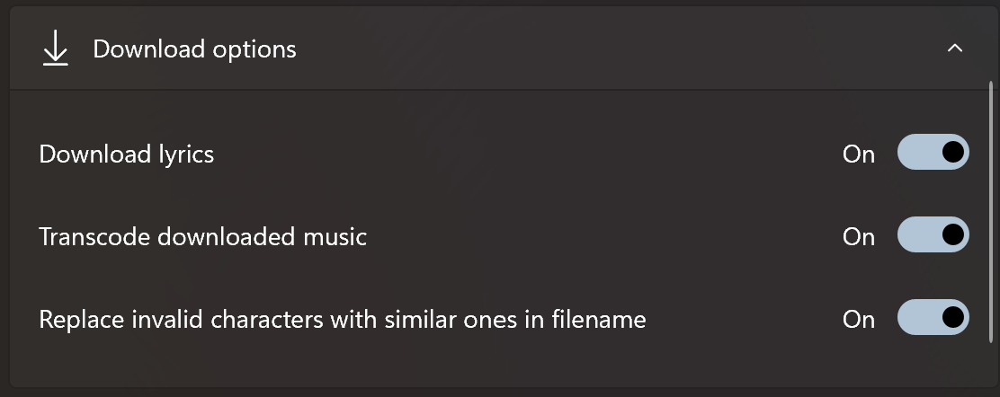
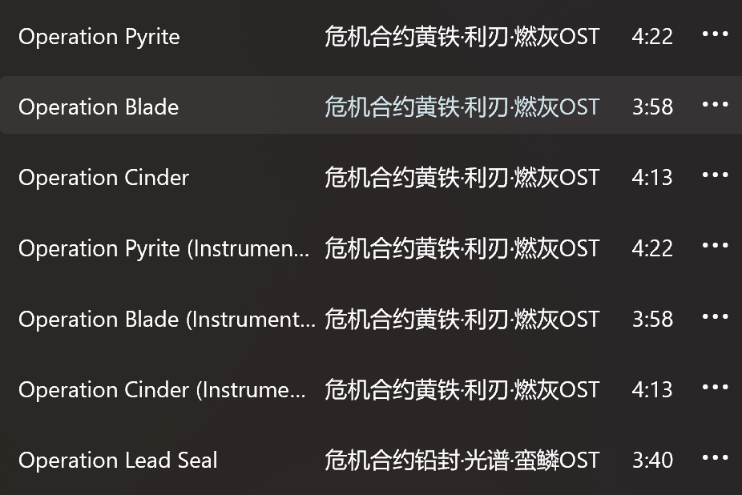

# Version 1.2.4.0

Welcome to use the new version of Sora Records, this update mainly made the following changes: 

- Added play next feature - You can now schedule specific music to play after the current song.
- Added feature that changes language - Currently supports Simplified Chinese and English.
- Added the feature to replace invalid characters with similar ones during download.
- Optimized the album cover rendering process on various pages.
- Added hyperlinks to open corresponding albums for playlist items.
- Made numerous improvements to the Now Playing page.
- Optimized Glance Mode.

---

## Play next feature

You can now insert albums, songs, and playlists into the current playback queue to play next.

To use this feature, right-click on these items and click "Play Next".

## Language change feature

You can now change the app's language in the Settings page (Settings → Presentation settings → Language / 语言).

Please restart the app after switching languages to fully apply the changes.

You can restart the app automatically from the Settings page (Settings → About → Restart app). However, if your system is older (lower than Windows 10 version 1709), this option is unavailable. You will need to click "Close app" and restart it manually.

Currently, the app supports Simplified Chinese and English. If you wish to add more language, please [create a new Issue](https://github.com/Baka632/MonsterSiren.Uwp/issues/new/choose) in the app's GitHub repository.

## Replace invalid characters with similar ones during download

Some song titles (e.g., "2:00 PM in Mitsukue") contain characters that are invalid for filenames.

In previous versions, when downloading these songs, the app would simply remove these characters from the filename.

However, some users preferred these characters to be displayed as similar ones. Therefore, in the new version, some invalid characters are replaced with similar ones by default:

-   `"` (half-width) → `'` (half-width)
-   `?` (half-width) → `？` (full-width)
-   `:` (half-width) → `：` (full-width)
-   `<` → `[`
-   `>` → `]`
-   `|` → `I` (uppercase letter i)
-   `*` → `★`
-   `/` → `↗`
-   `\` → `↘`

Invalid characters not listed in this table will still be removed directly.

If you prefer not to use this feature, you can disable it in the settings (Settings → Storage settings → Download options → Replace invalid characters with similar ones in filename).

## Optimized album cover rendering process on various pages

Previously, when loading album covers, the app would only display a blank space without any placeholder.

In the new version, a placeholder is displayed while the image is loading.

Additionally, the process for caching album images has been optimized to reduce error rates and data usage.

## Added hyperlinks to open corresponding albums for playlist items

Now, on the playlist details page, each song displays a hyperlink for its album name.

Clicking these hyperlinks allows you to view the album information.

If you created the playlist before this version, you might need to wait a moment for the album name text to appear.

## Numerous improvements to the Now Playing page

This version brings many improvements to the Now Playing page, primarily adding the following features:

### Added ability to expand/collapse the Now Playing list using mouse wheel, touchpad, and gestures

On the Now Playing page, you can now expand/collapse the Now Playing list via:

-   Mouse Wheel: Scroll down / Scroll up
-   Touchpad: Two-finger swipe up / Two-finger swipe down
-   Gesture: Swipe up / Swipe down

### optimized Now Playing page for narrow window sizes

Adjusted the layout of the Now Playing page when the window is relatively narrow.

### Added hyperlinks to open corresponding albums for items in the Now Playing list

Now, each song in the list displays a hyperlink for its album name.

Clicking these hyperlinks allows you to view the album information.

## Optimized Glance Mode

The Glance Mode no longer reduces brightness when the app is in the background.

Furthermore, the brightness reduction level for Glance Mode has been set to the minimum (10% brightness → 0% brightness).

Finally, the Glance Mode no longer keeps the screen on when playback is paused.

---

## Other miscellaneous updates + fixes

- Enabled prelaunch functionality.
- Optimized some text descriptions.
- Disabled features unusable on Xbox for the Xbox version (Media casting and metered network warning).
- Added mitigation measures for exceptions when querying codecs.
- The application no longer crashes when activated with an invalid URI.
- Refactored the code implementing easter eggs and updated the list of songs that trigger them.

> Last but certainly not least, thank you for using Sora Records!