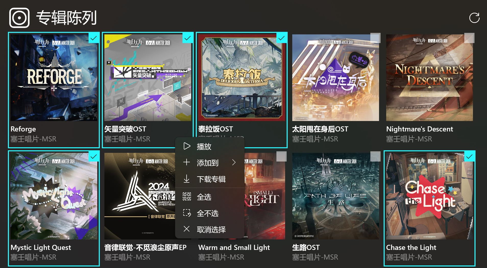
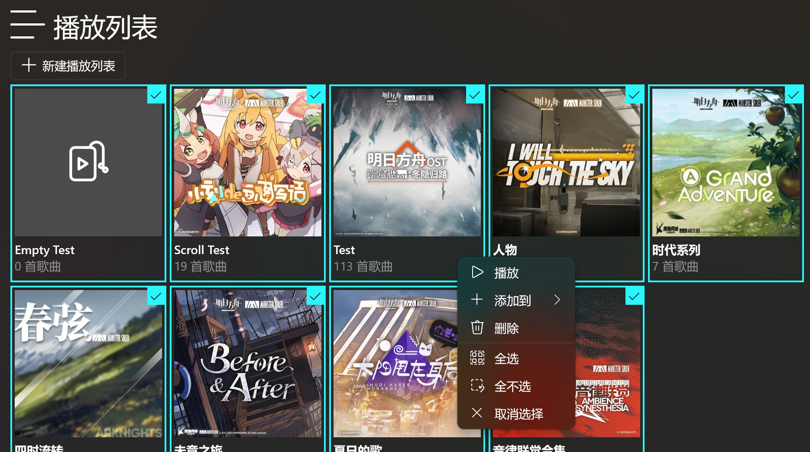

# 版本 1.2.2.0

欢迎使用新版本的 Sora 唱片，本次更新主要进行了以下更改：

- 概览模式优化 - 现在概览模式添加了使用指引、更多的退出方式和保持屏幕常亮的设置。
- 双击播放 - 现在可以双击播放专辑和播放列表内的单曲了。
- 多选功能 - 现在可以在专辑陈列页和播放列表页添加使用多选功能了。
- 专辑详细信息页更新 - 现在添加了单曲序号。
- 下载过程优化。
- 添加了检查更新功能。

---

## 概览模式优化
### 使用指引

在进入概览模式后，您可能不知所措。

在这个版本里，我们添加了使用指引，来帮助您更好地使用概览模式。

### 更多的退出方式

除了点击标题栏上的返回按钮以外，现在还新增了按下 Esc 键和双击任意位置退出的功能。

### 屏幕常亮

这个版本添加了屏幕常亮设置，来防止在概览模式启用时出现屏幕保护程序或屏幕关闭的情况。

## 双击播放

现在在专辑详细信息页和播放列表详细信息页中，可以双击列表中的单曲了。

## 多选功能

这个版本可以在专辑陈列页和播放列表页分别对专辑和播放列表使用多选功能了。

不过，如果在专辑陈列页选择了太多专辑，则在进行某些操作时可能会出现警告：

如果您确实要这样做，请保持耐心，这需要花费一些时间......

## 专辑详细信息页更新

现在为列表中的歌曲添加了单曲序号显示。

注意：播放列表详细信息页中没有添加单曲序号。

## 下载过程优化

现在应用会避免重复下载歌曲，重复的歌曲在下载列表中会被标记为“已跳过”。

另外，还为下载项添加了“取消中”状态。这种状态表示下载项正在清理其在下载过程中产生的文件。

## 检查更新功能

现在应用会尝试自动检查更新，如果有可用更新，应用会弹出一个提示。

---

## 其他杂项更新 + 修复

- 去除一些文本中的引号
- 为下载列表添加虚拟化
- 优化获取和保存专辑封面的过程
- 将设置页中呈现设置项的 XAML 代码整理为 `SettingsExpander` 和 `SettingsCard` 控件 
- 修复无效项加入正在播放列表时出现未捕获异常的问题
- 修复在未成功获取专辑陈列页中专辑的情况下，刷新时出现未处理异常的问题
- 修复重新启动应用后，恢复下载项时下载项状态错误的问题
- 修复不显示下载文件夹和播放列表文件夹重定向信息的问题

> 最后，感谢您使用 Sora 唱片！