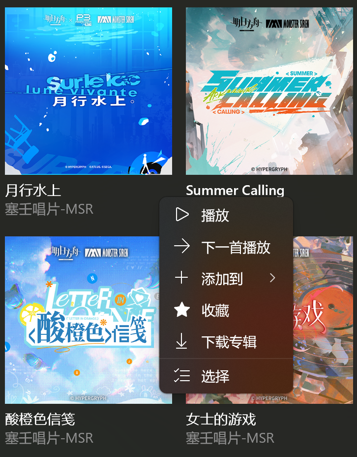
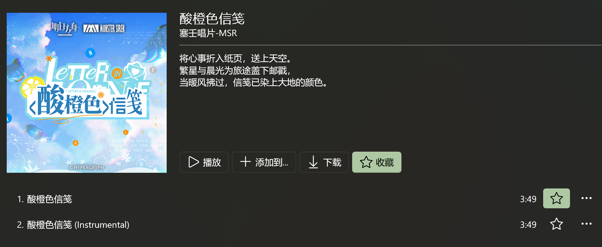
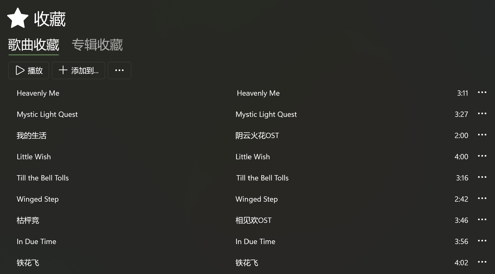
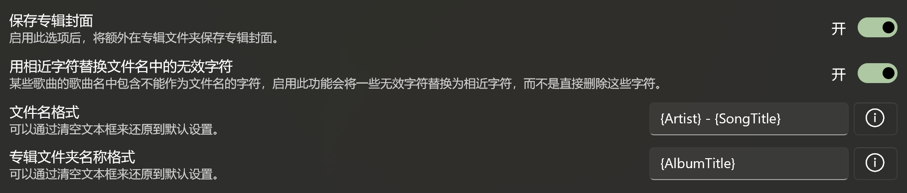

# 版本 1.2.5.0

欢迎使用新版本的 Sora 唱片！本次更新主要进行了以下更改：

- 添加收藏功能 – 现在可以将单首歌曲或整张专辑添加到收藏中。
- 下载功能优化 – 支持自定义文件名和专辑文件夹名称模板，并可额外保存封面图片。
- 播放时优先使用已下载的音乐 – 减少网络流量，提升离线播放体验。

以及幕后许多的代码重构！

---

## 收藏夹功能

现在，您可以将喜欢的单首歌曲或整张专辑添加到收藏中。

在专辑封面、歌曲条目或播放列表项目上，右键点击（或长按）即可找到“收藏”选项。专辑详情页和歌曲列表中同样提供了收藏按钮。

收藏的内容会统一显示在新增的“收藏”页面中，您可以在此浏览、播放、下载或将收藏内容添加到播放列表。收藏夹支持备份与还原，您可以在设置页的“存储设置”中找到相关选项，将收藏导出为 JSON 文件，或从之前备份的文件中恢复。

## 下载增强

本次更新对下载功能做了多项改进：

- **自定义文件名模板**：您可以在设置页的“存储设置”中，自定义下载歌曲的文件名格式，可在设置页面中查看可用的占位符。
- **自定义专辑文件夹名称模板**：支持自定义专辑文件夹的命名格式，可在设置页面中查看可用的占位符。
- **保存封面图片**：启用该选项后，下载歌曲时会同时将专辑封面保存到对应专辑文件夹中。
- **允许不必要的转码**：对于原文件为 MP3 格式的歌曲，默认不会转码为 FLAC（避免无意义操作）。如果您确有需要，可在设置中开启“允许不必要的转码操作”。
- **Bug 修复**：修复专辑名称以点结尾时，不能启动下载的问题。

## 播放体验改进

- **优先使用本地文件**：当您已下载某首歌曲时，播放器会自动优先使用本地文件进行播放，以降低流量消耗，提升加载速度。您可在“设置 → 播放设置”中开关此功能。
- **优化音频时长获取方式**：现在经过优化，应用可以更快地获取歌曲时长。

---

## 其他杂项更新 + 修复

- 更新了部分文本描述，并调整了一些本地化资源。
- 大量的代码重构与问题修复，如果您感兴趣，可以查看[这里](https://github.com/Baka632/MonsterSiren.Uwp/pull/33)。

> 最后，感谢您使用 Sora 唱片！