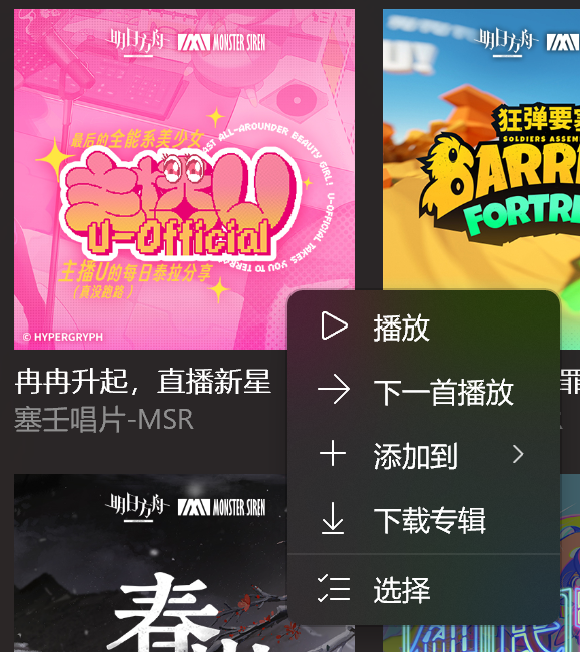

# 版本 1.2.3.0

欢迎使用新版本的 Sora 唱片，本次更新主要进行了以下更改：

- 添加投送音频功能 - 现在可以将音乐投送到其他设备了。
- 添加小娜支持 - 如果您的设备仍然可以使用小娜，那么您的小娜可以使用本应用的功能了。

---

## 投送音频功能

现在，可以将正在播放的音乐投送到其他设备了。

要使用此功能，请在播放栏处的溢出菜单中点击“开始音乐投送”。

之后，将会弹出 Windows 系统的“连接”窗口，请在里面选择目标设备。

选择后，指定的设备将会开始播放，可以在本应用的窗口中调整其音量，并使其播放/暂停音乐（需要目标设备支持）。

要停止音频投送，可以点击溢出菜单中的“直接停止音频投送”按钮。

也可以打开投送面板，并在“连接”窗口中选择“断开连接”。

当应用处于音频投送状态时，概览模式中会出现指示音频投送的图标。

## 小娜支持

如果您的设备仍然支持小娜，且系统版本号低于 Windows 10 2004（Build 19041，微软在这个版本中移除了小娜的语音命令支持），那么您可以尝试使用小娜来使用本应用的功能了。

本应用在小娜的唤醒词是“小空”，这意味着本应用的语音命令均以“小空”开头。

例如：

- 小空，播放最新专辑。 
  
- 小空，有哪些新专辑？
  

另外，如果您向小空提出一些奇妙的问题，也许会出现奇妙的回复...？

---

## 其他杂项更新 + 修复

- 桌面端支持的最低版本降低为 Windows 10 1703（Build 15063）。
- 优化一些文本描述。
- 修复由于对某些专辑封面缓存访问出现问题而导致的部分歌曲下载异常的问题。
- 修复由于某些歌曲的专辑名/歌曲名/艺术家名存在多余空格导致写入音乐信息及转码时出错的问题。

> 最后，感谢您使用 Sora 唱片！