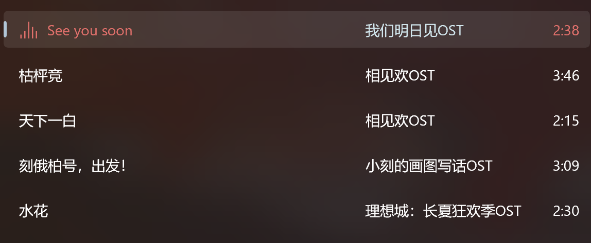

# 版本 1.2.4.0

欢迎使用新版本的 Sora 唱片，本次更新主要进行了以下更改：

- 添加下一首播放的功能 - 现在可以将指定的音乐安排在当前歌曲之后播放了。
- 添加更改语言的功能 - 目前支持简体中文及英语。
- 添加下载时使用相近字符替换无效字符的功能。
- 优化各个页面对专辑封面的呈现过程。
- 为播放列表项目添加打开对应专辑的超链接。
- 对正在播放页进行了大量改进。
- 优化概览模式。

---

## 下一首播放功能

现在，可以将专辑、歌曲及播放列表插入到正在播放队列中，作为下一个播放项了。

要使用此功能，请右键这些项目，并选择“下一首播放”。

## 更改语言功能

现在可以在设置页中更改应用的语言了（设置 → 显示设置 → 语言 / Language）

切换语言后请重启应用，以完全应用更改。

可以在设置页中自动重启应用（设置 → 关于 → 重启应用），但如果系统较老（Windows 10 1709 以下），则没有这个选项。您只能点击“关闭应用”后手动重启。

目前，本应用支持简体中文及英语。如果您希望添加语言支持，请在本应用的 GitHub 仓库中[提出一个新 Issue](https://github.com/Baka632/MonsterSiren.Uwp/issues/new/choose)。

## 下载时使用相近字符替换无效字符功能

某些歌曲（如《2:00 PM in Mitsukue》）的歌曲名中包含不能作为文件名的字符。

在旧版本下载这些歌曲时，应用会在文件名中直接删去这些字符。

不过，一些用户希望将这些字符显示为相近的字符。因此在新版本中，默认会将一些无效字符替换为相近字符：

- `"`（半角） → `'`（半角）
- `?`（半角） → `？`（全角）
- `:`（半角） → `：`（全角）
- `<` → `[`
- `>` → `]`
- `|` → `I`（大写字母 i）
- `*` → `★`
- `/` → `↗`
- `\` → `↘`

此表之外的无效字符仍然会被直接删去。

如果您不想使用此功能，可以在设置中关闭（设置 → 存储设置 → 下载选项 → 用相近字符替换文件名中的无效字符）

## 优化各个页面对专辑封面的呈现过程

之前，应用在加载专辑封面时，只会显示一处空白，没有任何占位符。

在新版本中，加载图像时会显示一个占位符。

除此之外，还优化了缓存专辑图像时的过程，以减少错误率和流量使用量。

## 为播放列表项目添加打开对应专辑的超链接

现在在播放列表详情页中，每首歌曲都会显示专辑名称的超链接了。

单击这些超链接，便可查看专辑的信息。

如果您在这个版本之前就创建了播放列表，那么您可能需要稍等片刻，才能看见专辑名称的文本。

## 对正在播放页进行的大量改进

这个版本对正在播放页做出了大量改进，主要添加了这些功能：

### 添加使用鼠标滚轮、触摸板及手势展开/收回正在播放列表的功能

在正在播放页中，通过以下方式，便可展开/收回正在播放列表：

- 鼠标滚轮：向下滚动/向上滚动
- 触摸板：双指向上滑动/双指向下滑动
- 手势：向上滑动/向下滑动

### 优化正在播放页在较窄窗口大小时的显示

调整了窗口较窄时，正在播放页的布局。

### 为正在播放列表中的项目添加打开对应专辑的超链接

现在，列表中每首歌曲都会显示专辑名称的超链接了。

单击这些超链接，便可查看专辑的信息。

## 优化概览模式

现在，应用进入后台后，概览模式不再降低亮度。

另外，还将概览模式降低亮度的级别调到最低（10% 亮度 → 0% 亮度）

最后，当播放暂停时，概览模式不再保持屏幕常亮。

---

## 其他杂项更新 + 修复

- 启用预启动功能。
- 优化一些文本描述。
- 在 Xbox 上禁用 Xbox 不能使用的功能（媒体投送及流量计费网络提示）
- 添加当查询编解码器时出现异常的缓解措施。
- 当激活应用的 URI 无效时，应用不再崩溃。
- 重构实现彩蛋的代码，并更新会触发彩蛋的歌曲列表。

> 最后，感谢您使用 Sora 唱片！